# ⚡ Electric Charging Stations Analysis in Italy 🇮🇹

This project focuses on analyzing the distribution, accessibility, and strategic positioning of electric vehicle (EV) charging stations in Italy, with particular emphasis on the **Lombardy** region. Through a combination of spatial analysis, statistical correlation, and priority mapping, the project identifies critical gaps and proposes data-driven insights for infrastructure improvements.

---

## 🎯 Objectives

- Assess the **distribution** of EV charging stations across Italy.
- Evaluate **accessibility and saturation** in different regions.
- Identify **strategic areas** lacking sufficient infrastructure.
- Develop a **Priority Map** to guide future installations.

---

## 📊 Datasets Used

1. **EV Charging Stations (2023)**  
   Sourced via [Overpass Turbo](https://overpass-turbo.eu/) – up to December 31, 2023.

2. **Electric Vehicle Circulation by Region**  
   Data from [Piattaforma Unica Nazionale](https://www.piattaformaunicanazionale.it/territory-bev)

3. **Population by Region (ISTAT)**  
   Official statistics from ISTAT (Italian National Institute of Statistics).

---

## 🧪 Methodology & Analyses
### 1. 🔴 Mapping Charging Station Density
- A thematic map was created to visualize charging station density per region.
- Normalization of charging station numbers based on regional surface area.
- **Key findings**:
  - **Regions with the highest number of stations:** Lombardy (515), Veneto (470), Friuli Venezia Giulia (195).
  - **Regions with the lowest number of stations:** Sardinia (27), Basilicata (9).
    <br><br>
   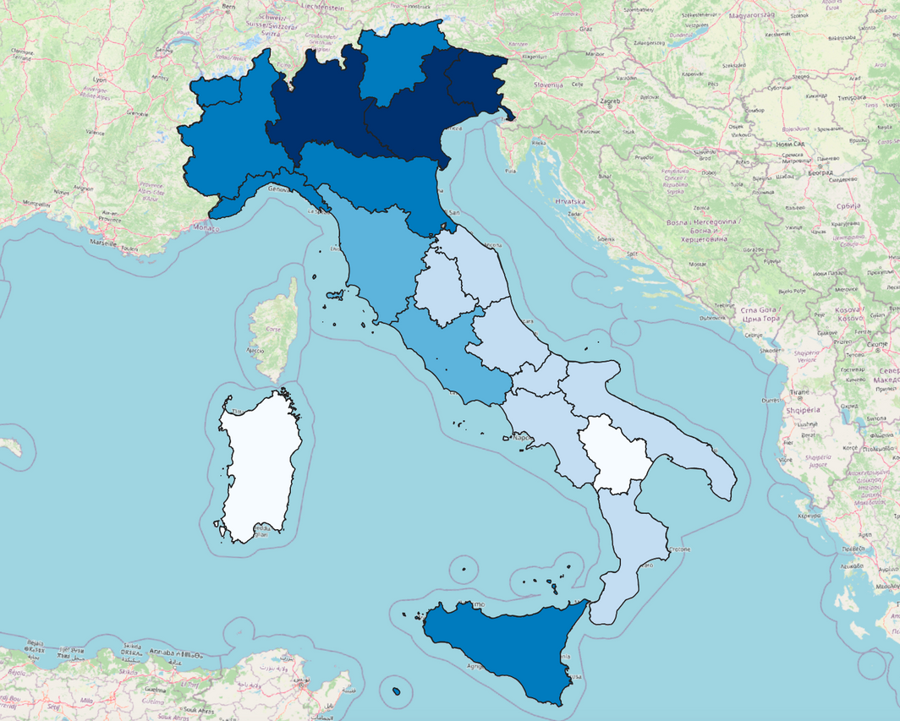
---

### 2. 🧩 Spatial Clustering of Charging Stations
- **Tool**: DBSCAN algorithm via QGIS.
- **Goal**: Visualize clusters of EV stations to identify areas of high density.
- **Parameters**: Min Points: 2 | Max Distance: 5 km  
- **Findings**: Northern regions like Lombardy show higher cluster concentrations (e.g., 465 clusters), while southern areas like Basilicata show minimal presence (only 5 clusters).
   <p>
     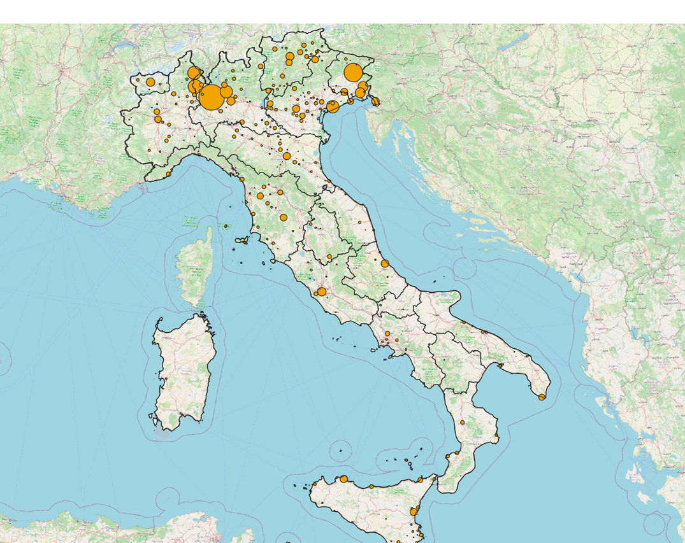
     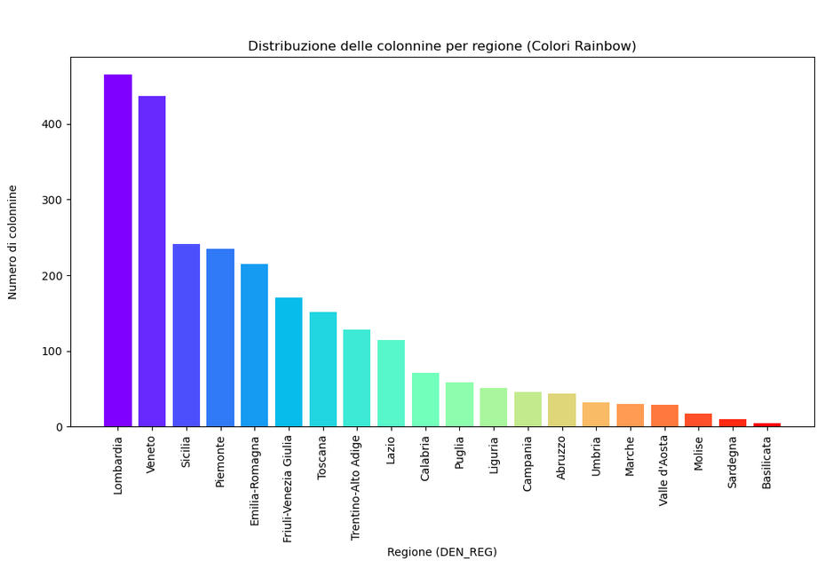
   </p>
---

### 3. 🔗 Correlation between Stations & EV Circulation
- **Method**: Pearson correlation coefficient.  
- **Result**: A strong positive correlation (r = 0.71, p-value = 0.0005) suggesting that better infrastructure may boost EV adoption.

---

### 4. 🔄 Saturation Analysis by Region
- **Formula**: Saturation = EVs / Charging Stations  
- **Interpretation**:
  - High saturation = potential congestion, need for expansion.
  - Low saturation = balanced infrastructure.  
- **Insight**:  
  - *Highest*: Trentino-Alto Adige → 35,746 EVs / 151 stations.  
  - *Lowest*: Friuli-Venezia Giulia → 3,632 EVs / 195 stations.
   <br><br>
   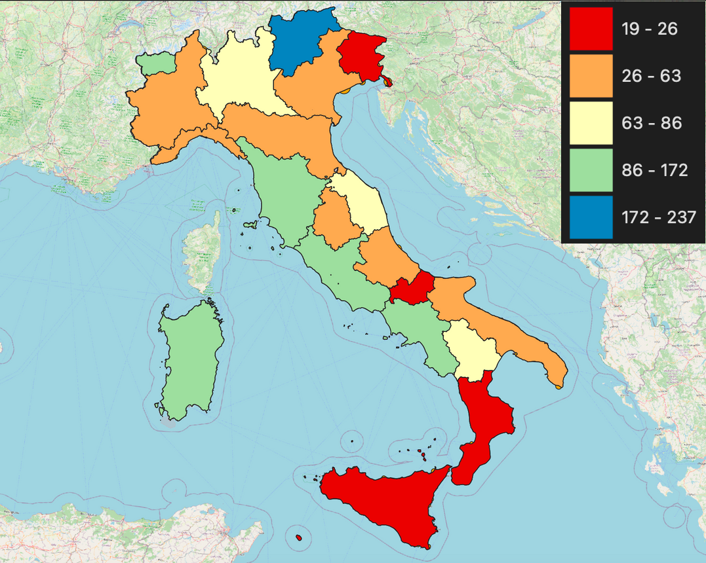
---

### 5. 🌍 Land Use Raster Analysis
- **Data**: CORINE Land Cover 2018 from Copernicus.  
- **Goal**: Identify the type of land where stations are located.  
- **Result**:  
  - Urban areas: 72.8%  
  - Rural/Extra-urban: 27.2%
   <p>
     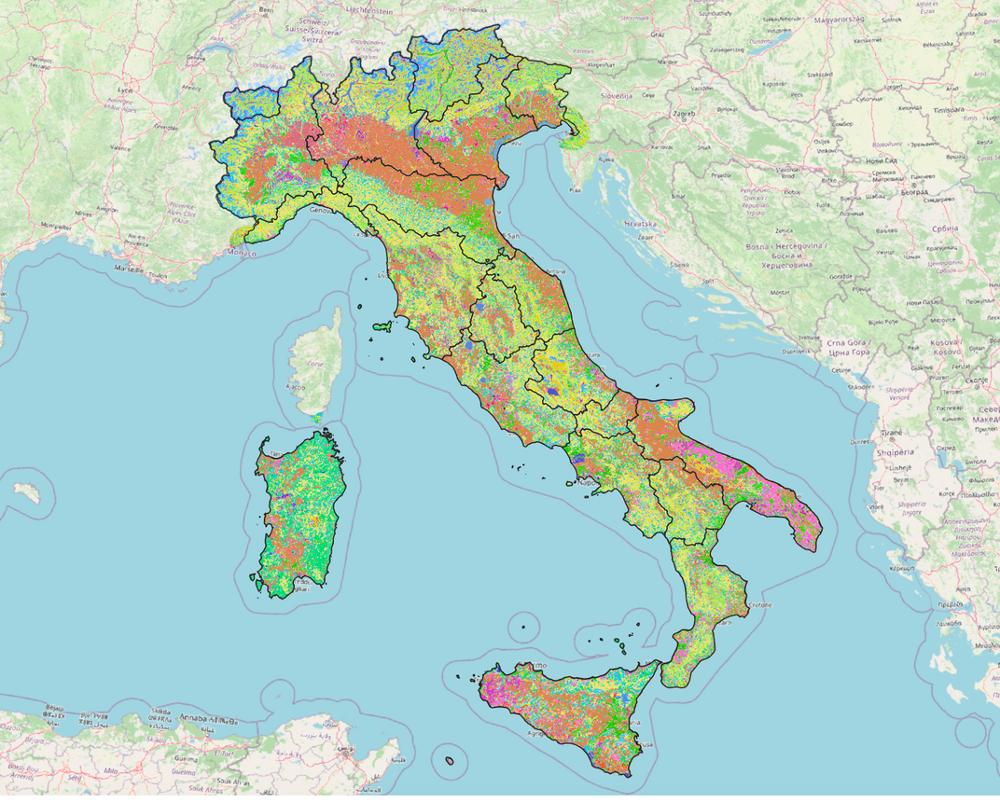
     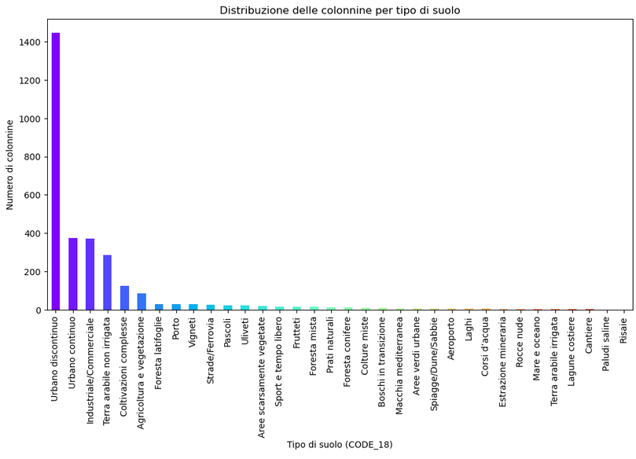
   </p>
---

### 6. 📍 Points of Interest Analysis (Strategic Zones)
- **Approach**: Heatmap distribution by land use.  
- **Insight**: Stations are concentrated in limited strategic zones – mostly in:
  - Urban Areas
  - Ports
  - Roads & Railways
    <br><br>
   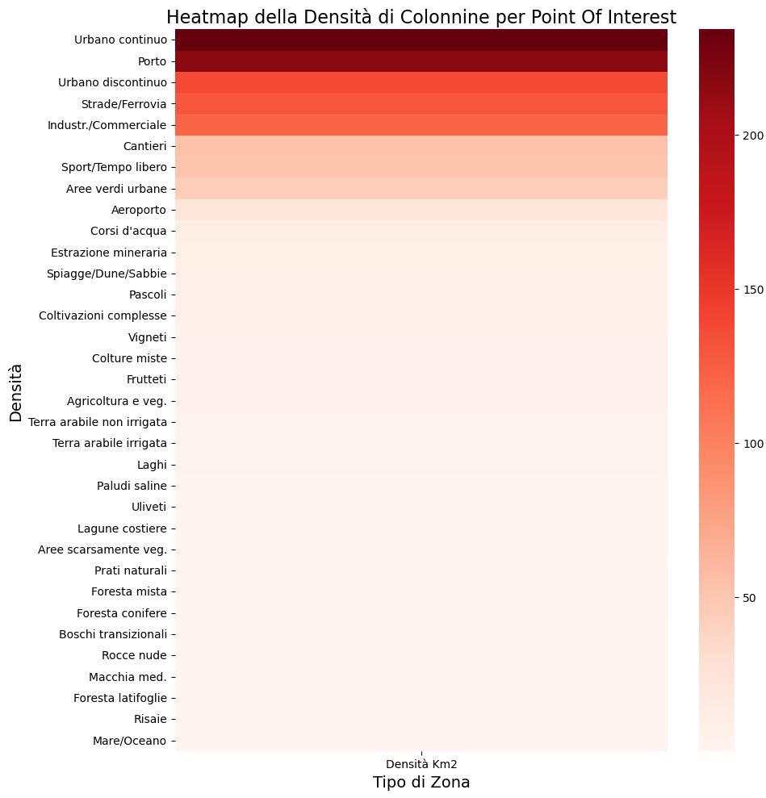
---

### 7. 🛣️ Motorway Network Analysis – Focus on Lombardy
- **Tool**: QuickOSM (for motorway network).  
- **Goal**: Assess the presence of charging stations along highways.  
- **Findings**:  
  - Only **64 out of 515** stations in Lombardy are on motorways.
  - Motorways rank **below rural zones** like pastures and forests in station density.
- **Conclusion**: Reinforces the need for boosting long-distance EV travel infrastructure.
<p>
   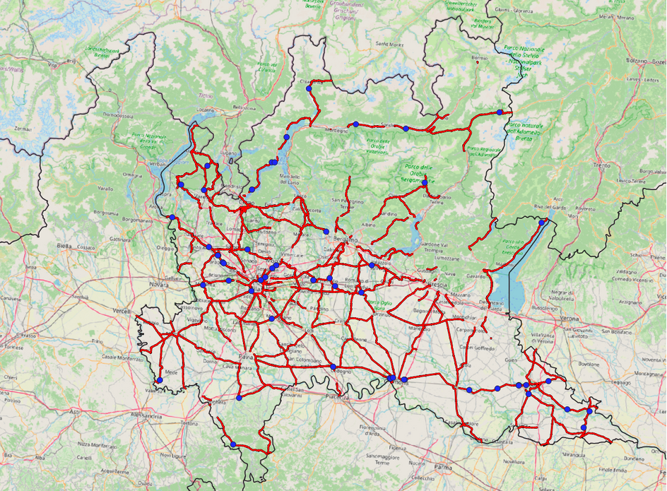
   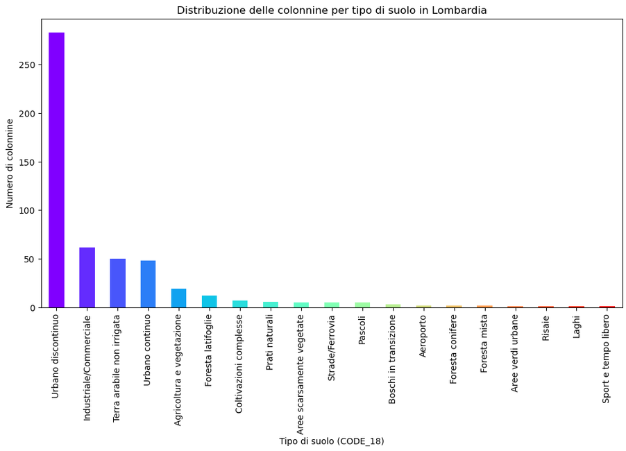
</p>

---

### 8. 🕒 Accessibility Analysis (Ischrones – Lombardy)
- **Tool**: ORS Tools in QGIS  
- **Method**: Generate 5 and 10-minute driving isochrones around each station.  
- **Result**:  
  - 72.9% of Lombardy is covered (≤10 min drive).  
  - 27.1% remains **uncovered**.
    <br><br>
   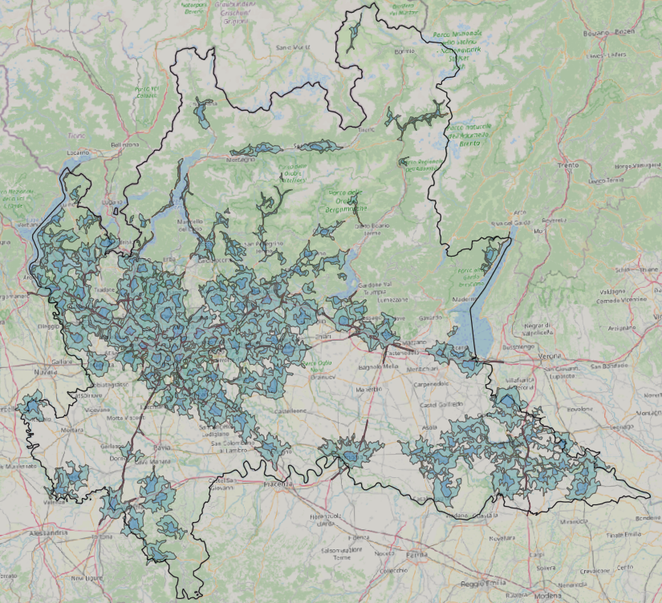
   
---

### 9. 🏙️ Urban Gaps – Lombardy
- Urban areas represent strategic installation points due to higher demand.
- **Findings**:  
  - 72% of urban zones in Lombardy are covered.  
  - 28% uncovered – including entire cities like **Pavia**.
<br><br>
   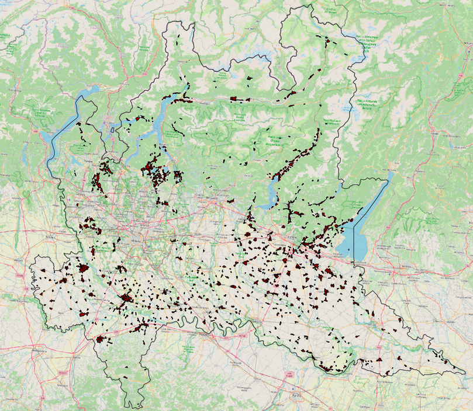
---

### 10. 🗺️ Urban Gaps – Italy-Wide
- Extended the previous analysis nationwide.
- **Regions with highest urban coverage**:  
  - Valle d’Aosta (79%), Friuli-Venezia Giulia (72%), Lombardia (72%)  
- **Lowest coverage**:  
  - Basilicata (16%), Sardinia (19%), Molise (20%)
   <p>
      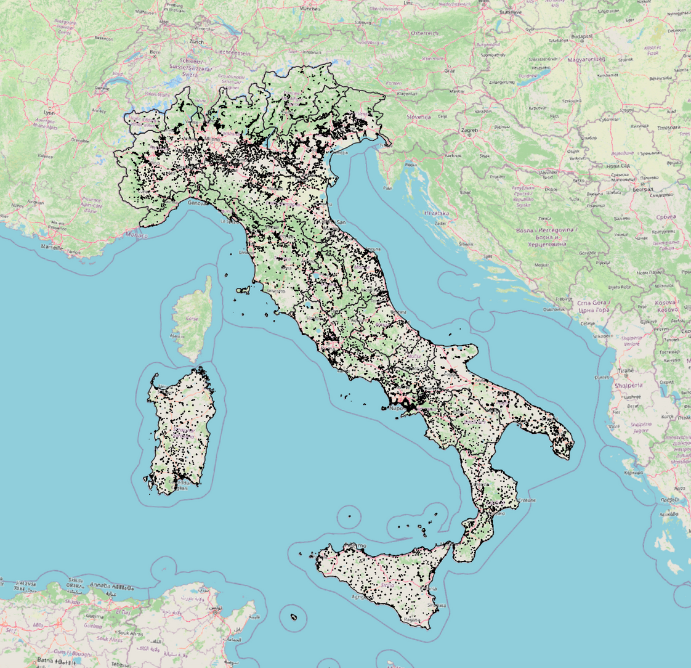
      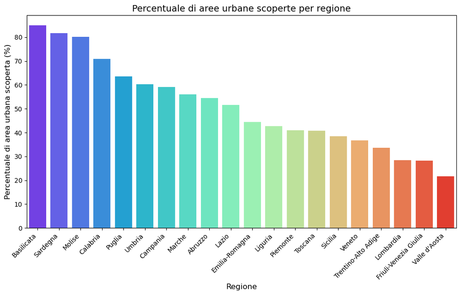
   </p>
---

### 11. 🔴 Priority Map for Future Installations
- **Objective**: Identify regions with the **highest urgency** for new EV stations.
- **Formula**: Priority = 0.4 * (Saturation_norm) + 0.3 * (EV Fleet_norm) + 0.15 * (Stations_norm) + 0.15 * (Population_norm)
- - **Visualization**: Bubble Chart  
- Red + Large = High Priority  
- Blue + Small = Low Priority

- **Top Priority**: Trentino-Alto Adige (0.75)  
- **Lowest Priority**: Friuli-Venezia Giulia (0.04)
<br><br>
   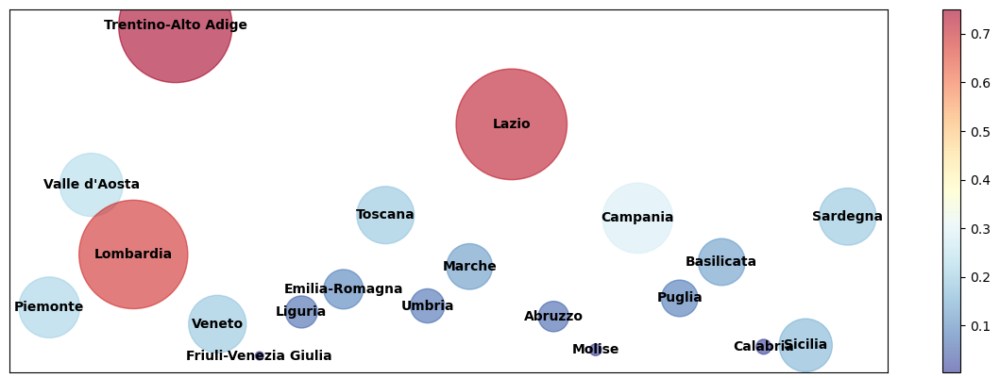
---

## ✅ Final Results & Conclusions

| Topic              | Summary |
|--------------------|---------|
| **Strategic Locations** | Urban areas dominate in station presence, but some cities are still unserved. |
| **Saturation**         | Some regions appear well-equipped, but high saturation reveals service strain. |
| **Coverage**           | Isochrone analysis highlights key urban gaps, essential for planning. |
| **Future Outlook**     | The Priority Map helps pinpoint where new stations are **urgently needed**. |

---

## 📁 Project Structure

```plaintext
├── ExportedDatasets/ #Dataset used for analysis
├── images/  #images for  README.md
├── AnalisiCluster.ipynb/              # Python script for cluster analysis
├── AnalisiPearson.ipynb/              # Python script for Pearson analysis
├── AnalisiRaster.ipynb/              # Python script for Raster & Point of interest analysis
├── E-Mobility-Access.qgz           # QGIS Project File
├── Layer.zip           # QGIS Project File
├── README.md             # Project documentation (this file)
```
## 👨‍💻 Author

**Mario Cicalese**
🔗 [LinkedIn](http://www.linkedin.com/in/mario-cicalese-5b26a5283) • [GitHub](https://github.com/MarioCicalese)

**Irene Gaita**
🔗 [LinkedIn](http://www.linkedin.com/in/irene-gaita-4ba32822b) • [GitHub](https://github.com/IreneGaita)
